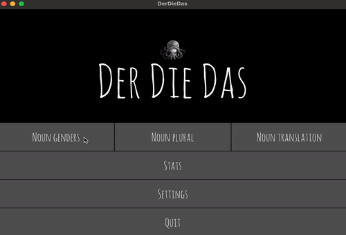

# 🐙 Der Die Das 📚 

<p align="center">
  
</p>

The `Der Die Das` is a [Kivy](https://kivy.org/) desktop app to help practice the German noun genders.

## 🔍 Prerequisites 

- [Python 3.12](https://www.python.org/downloads/release/python-3125/)
- [Poetry](https://python-poetry.org/)

## 👟 Running
Build the Python project by running: 

```
poetry build
```

Then install the python package:

```
python3.12 -m pip install /dist/der_die_das-0.1.0.tar.gz
```

Finally you may run the `Der Die Das` app by executing:
```
derdiedas
```

## 🏗️ Developing

```
poetry install
```

```
poetry run derdiedas
```

## 📈 German Nouns Data

The [`./data/all_chapters.csv`] (data/all_chapters.csv) file  has all the data required to run this application. The first time you run the app run it will read the data from the `csv` file and load them to an [sqlite](https://www.sqlite.org/) database.

However, it's possible to also use your own `csv` file. The only requirement is that it needs to have the following headers:

- `gender`
- `noun`
- `plural`
- `translation`

For example:

```
gender,noun,plural,translation
die,Begrüßung,-en,the greeting
das,Foto,-s,the photo
der,Herr,-en,the gentleman
```

then you can load the `csv` data to the database by running:
```
poetry run derdiedas_db -c PATH/TO/YOUR/CSV/FILE.csv
```

Alternatively:
```
derdiedas_db -c PATH/TO/YOUR/CSV/FILE.csv
```

# 🤌🏻 Future work
- Port to Android

